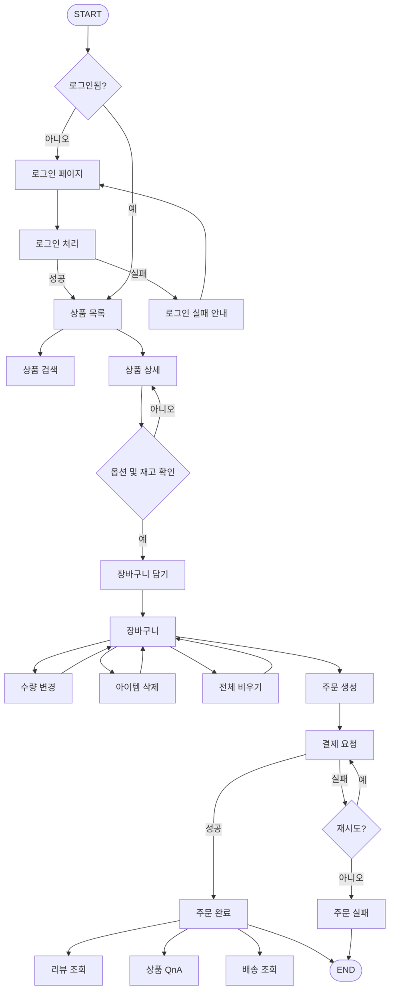
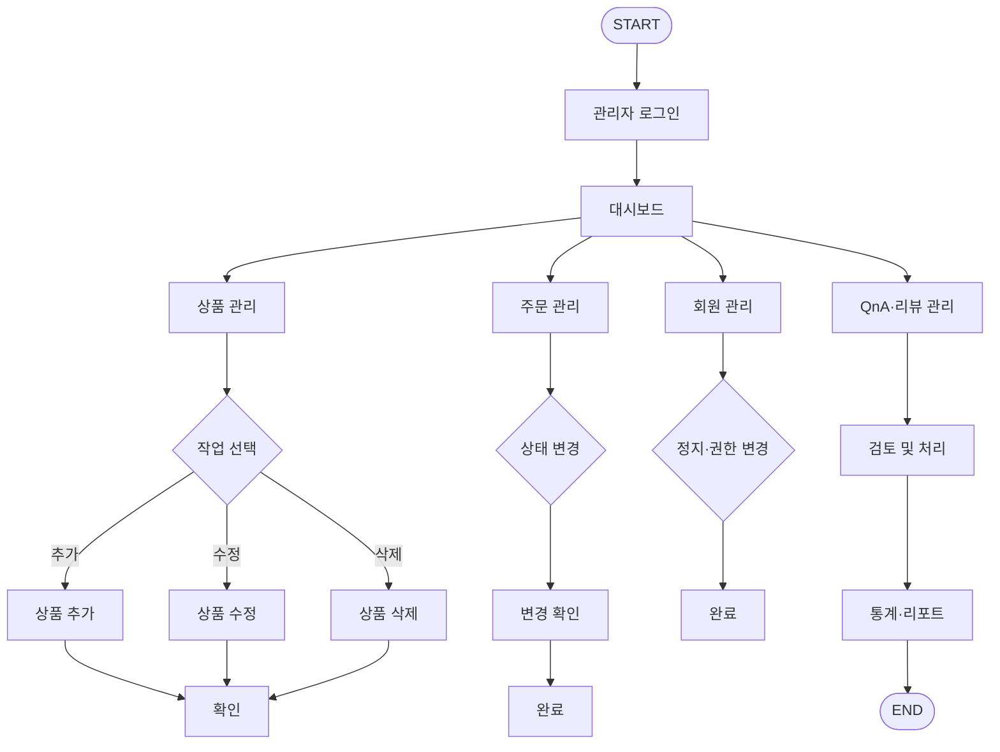

```mermaid
flowchart TD
  A([START]) --> B{로그인됨?}
  B -- 아니오 --> L[로그인 페이지]
  L --> L1[로그인 처리]
  L1 -->|성공| C[상품 목록]
  L1 -->|실패| Lf[로그인 실패 안내] --> L

  B -- 예 --> C
  C --> S[상품 검색]
  C --> D[상품 상세]
  D --> Q{옵션 및 재고 확인}
  Q -- 예 --> CA[장바구니 담기]
  Q -- 아니오 --> D

  CA --> H[장바구니]
  H --> E1[수량 변경] --> H
  H --> E2[아이템 삭제] --> H
  H --> E3[전체 비우기] --> H
  H --> O[주문 생성]

  O --> P[결제 요청]
  P -->|성공| SU[주문 완료]
  P -->|실패| RF{재시도?}
  RF -- 예 --> P
  RF -- 아니오 --> FL[주문 실패]

  SU --> RV[리뷰 조회]
  SU --> QNA[상품 QnA]
  SU --> TRK[배송 조회]

  SU --> Z([END])
  FL --> Z
```

```mermaid
flowchart TD
  A([START]) --> AD[관리자 로그인]
  AD --> DASH[대시보드]

  DASH --> PM[상품 관리]
  DASH --> OM[주문 관리]
  DASH --> UM[회원 관리]
  DASH --> CM[QnA·리뷰 관리]

  PM --> PMA{작업 선택}
  PMA -->|추가| PADD[상품 추가] --> POK[확인]
  PMA -->|수정| PEDIT[상품 수정] --> POK
  PMA -->|삭제| PDEL[상품 삭제] --> POK

  OM --> OMA{상태 변경}
  OMA --> OCONF[변경 확인] --> OOK[완료]

  UM --> UMA{정지·권한 변경}
  UMA --> UOK[완료]

  CM --> MOD[검토 및 처리] --> REP[통계·리포트]
  REP --> END([END])

```

